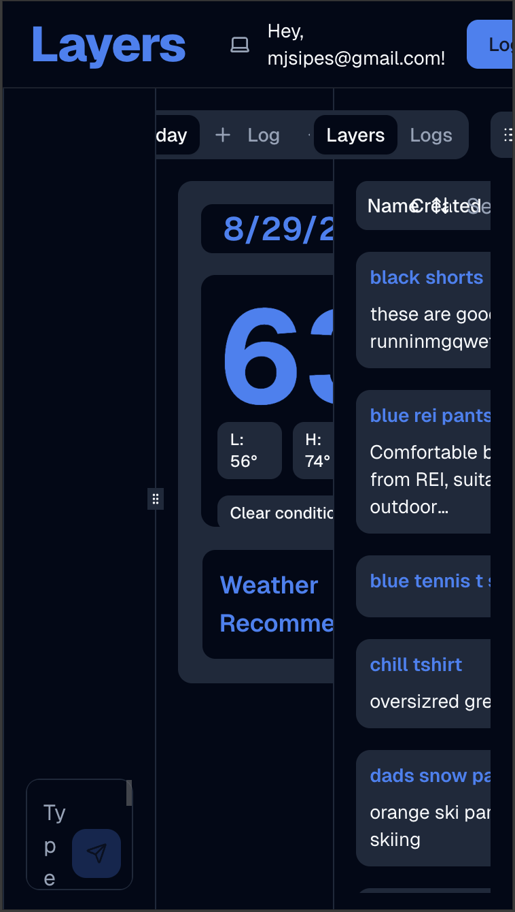
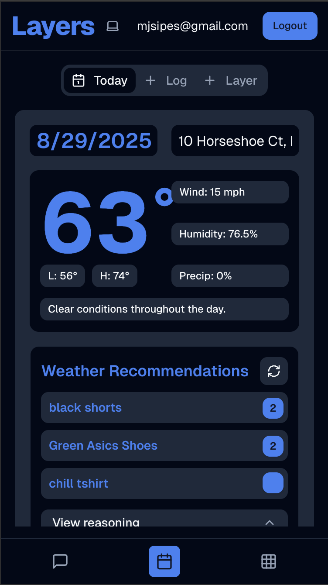
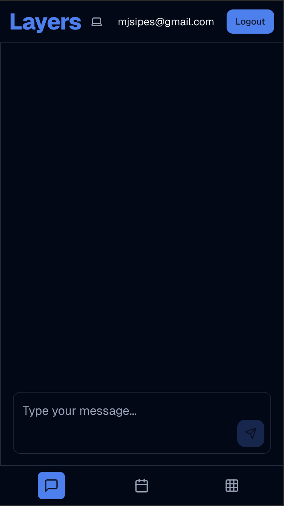
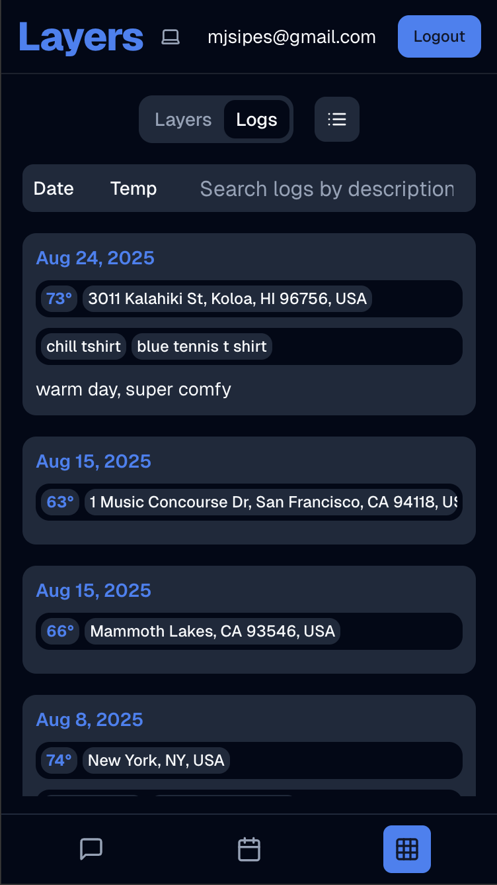

# layers4.vercel.com 👕🎿⚡

**Live App: https://layers4.vercel.app/**

## The Journey Behind the Tech

I was skiing last winter when I got the idea for this app. As an intermediate skier who grew up skiing about 10 days a year, I never dressed right. It was either freezing cold out and I was freezing, or somehow it was not cold enough and I ended up really hot. If you have ever skiied before, reflect on this thought and think if you can relate or not. If you havent skiied before, take it from me, its impossible to dress right for the weather. 20 degrees and 30 degrees sound like the same type of cold when you grow up with most days being 60's and 70's. But 20 degrees and 30 degrees are very different types of cold.

Chat gpt alone knows the weather and can reason about good outfits to wear. 
Journal entries is the perfect context for ai to reason about what outfit recomendations. 

I beleive connecting them would yeild accurate recomendations for what to wear for a day of skiing.

That is when I thought of creating layers. An app aimed at doing exactly this.

## Tech Stack
- **Frontend**: [Next.js](https://nextjs.org/) with [TypeScript](https://www.typescriptlang.org/)
- **Backend**: [Supabase](https://supabase.com/) + [Next.js API Routes](https://nextjs.org/docs/pages/building-your-application/routing/api-routes)
- **Styling**: [Tailwind CSS](https://tailwindcss.com/) + [shadcn/ui](https://ui.shadcn.com/)
- **AI**: [Vercel AI SDK](https://sdk.vercel.ai/) with [OpenAI API](https://openai.com/api/)
- **APIs**: [Google Maps API](https://developers.google.com/maps), [Visual Crossing Weather API](https://www.visualcrossing.com/weather-api/)
- **Hosting**: [Vercel](https://vercel.com/)

## The AI + Software Integration Experiment
In my implementation of layers, my greatest emphasis was on the integration of AI and Sophware. Currently, this is a transitional period from software to ai. 
### We ask: 
### AI eating Software
currently, ai is eating all software. IMO, AI will eat all educational software like quizlet. paid information is being eaten by ai, that is professions that are expertise, and software which provides information (laywers, doctors) (quizlet, chegg) how much more software will ai eat / will ai eat all software?
### AI integrating with Software
- we are integrating with software
- we are doing a lot of building ai on top of software
- will ai be build on top of software? 
- what type of integration will we want?
- will people make money from integrating software with ai?
- we are also asking what will the future of software and ai integration look like

For the user interface, I wanted to create a traditional user interface and an ai interface. I am curious if the future user interface is directly with ai, or an integration between ai and traditional ui. I was also curious to explore how i could integrate ai with software
about what type of interactions we will like to have with integrated ai, 

Both the user interface and ai interface can do everything the other can. 
I was curious to know which interfact people would like to use more.
I was curious what type of ways i could integrate ai with the traditional ui to improve the experience.
It was interested to note that creating a traditional ui was what i spent 80% of my time working on. Traditional ui = rigid. AI UI = flexible. Traditional ui I became obsessed about translating my idea of an app to give weather recomendaedion into the most intuitive design for a web page. But maybe AI UI is better and simpler to interact with than a traditional UI

Considerations: this app does exist only in a small point in time where it is possible to build and small point in time when it is useful. On the topic of AI eating software, this proejct only is better than pure AI because of the stored data and me attempting to create a traditional ui integrating AI which has a better user experience than pure AI interaction.
because right now so is not good at remembering stuff about you over a long period of time, so i can create a good application that stores the information about what a user wears and give that to the ai to help with the recommendations. One day though the ai will be so good at storing data or the context window will just be so big that it can remember everything you talk about with it from your birth to death and then my layers app will not be useful anymore

Maybe we flip the switch and have Original Ui integrate into AI with generated objects? 50% AI and 50% AI. Not integrated just right next to each other.

- ai should it output markdown, pull up display in dynamic area, or display inline components?

future:
- will chat gpt be able to do layers better / ai + database do layers better? and expanding to logging something else as well?

## Technical Challenges & Solutions

### MCP vs Tool Calling Architecture

i heard mcp is going to change the world. mcp = future of way ai interacts with services on the internet? , decided I must create an app with it. did deep research
https://modelcontextprotocol.io/docs/getting-started/intro
https://platform.openai.com/docs/guides/tools-connectors-mcp
https://developers.cloudflare.com/agents/guides/remote-mcp-server/
https://vercel.com/docs/mcp/deploy-mcp-servers-to-vercel

original architecture:
server: remote mcp server in cloudflare worker
client: supabase edge function calling openai api with reference to cloudflare server url

was a lot to manage.

second architecture: moved everything to nextjs api route
server: remote mcp server in nextjs api route
client: nextjs api route calling openai api with reference to cloudflare server url

benefit: all mcp logic both in the project directory (1 directory as opposed to 3)

when I added authentication to the app, I came to struggle with oath/passing user tokens/authentication with mcp server

realised I jumped the gun to using mcp technology, function calling was all i need to implement the app.

openai api function/tools vs vercel ai sdk

two most popular npm packages for ai, I understood open api is more foundational, vercel ai sdk is more abstract

tried open ai for tool calling

tried vercel ai sdk for tool calling

vercel ai sdk was increadibly easy

vercel ai sdk is amazing, super easy for tool calling, streaming, and ui components
https://ai-sdk.dev/docs/introduction

mcp vs toolcalling
ai integration areas

begining philosophy of mpc server-> ai with tool calling
- openai api for tool calling -> vercel ai sdk
- supabase vs cloudflare vs vercel mcp server problems and solutions. finding documentation / templates, getting it to work greate with cloudflare verses vercel mcp documentation

multiselect -> smart ai
- ai should it output markdown, pull up display in dynamic area, or display inline components?
- experiemented with adding ai to sort filter area, ended up preferring keyword search with tanstack whatever

### Responsive Design: Mobile-First Learning
- responsive design: learned important lesson to start with phone and then build up to desktop. i think the app right now is not well designed for mobile, to many buttons to press
i did not think about mobile first design when i was making this app. i kept sharing this app with friends and family and they opened it up on phone which looked horrible
[add photos?]
i have made it mobile friendly. now looking at it, i think ther are to many buttons / togle areas, and I have idea to move more down to the bottom navbar to be able to remove the tabslists at the top of the wardrove section and the home weather section. if successful i will apply to web as well. if I had first created for mobile, i might have optimized for space then and come to a better solution early on

before mobile friendly: https://layers4-r4mi3ac6w-mjsipes-projects.vercel.app/

| Before Mobile Friendly Design | Mobile Friendly Weather Panel | Mobile Friendly Chat Panel | Mobile Friendly Wardrobe Panel |
|------|---------|------|--------|
|  |  |  |  |

### State Management: Zustand vs Subscriptions
- disenfranchised by zustand, learning how little i understand about it. it is an npm package but is react agnostic, and you can not actually mount react hooks in zustand stores, makes it feel pretty confusing to me, to subscribe to a datatable and share that info across my app I needed two files. a hook, a zustand store, and I needed to mount the hook in another file in my app (app.tsx). If i use context, I could define the data and the subscription / fetching logic all in one file and then I would wrap the app with context in app.tsx. In total it takes an extra file to care for, which I did not like.

Also subscription issues. I do not know if this is a result of zustand or another problem with supabase subscriptions, I need to investigate further.
- zustand state mangement - we must check to see if it is causing subscription issues
- subscription issues

## What I'm Proud Of
feature rich sophisticated ui
ai vercel sdk
sign in with google, google maps geolocation
weather api
connecting ai to client through

## Personal Takeaways & What's Next

I think this is a demo, not a product. 
- reflect on time spent working on chatbot ui versus traditional ui (flexibility versus rigidness)
- fun thought; how can i make a successful business only apis / will there be a successful business only mcp?
