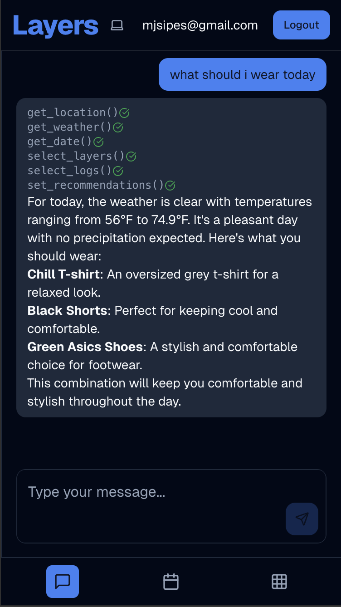

# Layers ❄️🎿

**An AI-powered skiing outfit recommendation app exploring the future of user interfaces**

## The Journey Behind the Tech

I was skiing last winter when I got the idea for this app. As an intermediate skier who grew up skiing about 10 days a year, I never dressed right. It was either freezing cold out and I was freezing, or somehow it was not cold enough and I ended up really hot. 

If you've ever skied before, reflect on this thought—can you relate? If you haven't skied before, take it from me: it's impossible to dress right for the weather. 20 degrees and 30 degrees sound like the same type of cold when you grow up with most days being 60s and 70s. But 20 degrees and 30 degrees are very different types of cold.

ChatGPT alone knows the weather and can reason about good outfits to wear. Journal entries provide the perfect context for AI to reason about outfit recommendations. I believed connecting them would yield accurate recommendations for what to wear for a day of skiing.

That's when I decided to build Layers—an app designed to solve this exact problem.

## Emphasis: What Is the Future of UI?

This project was also an exploration / experimentation of a fundamental question that's been consuming my thoughts: **What is the user interface of the future?**

I see two possible paths:

### Path 1: AI-First Interfaces
If chat interfaces become dominant, should developers focus on products exposed only through APIs and MCP servers? It's infinitely easier to build because there's no rigid interface to construct. In this case, I have the following questions:
- Will AI outputs stay in simple **Markdown**, evolve into **generated objects** with structured calls, or move toward directly generating **UI code (HTML/CSS/React)** on demand?
- What services should be exposed through MCP servers to bring real value? What do AIs actually need?
- From an entrepreneur's perspective, should I be thinking about software that's purely API/MCP-driven with no traditional UI?

### Path 2: Traditional UI with AI Integration
Companies like Cursor, Lovable, and Claude Canvas are succeeding by creating seamless AI integration into traditional interfaces. In this path, I wonder if becoming exceptionally skilled at this seamless integration can bring significant value—whether you can build a product or business around being the best at merging AI with conventional UI patterns.

What will this hybrid approach actually look like in practice?

## AI Integration Examples

Layers became my testing ground for these interface questions. Through building it, I explored different approaches to AI integration:

### Example 1: Dual AI UI and traditional UI - Success!

talk about the split screen, resizable window, both can do hte same thing, and ai can actually control the ui through the dynamic cards

I designed Layers with both traditional and AI interfaces that can perform identical operations on the database. The AI can dynamically pull up different components—displaying specific logs, layers, or immediately showing newly added items. When the AI adds layers, it can immediately display them for user review. Both the traditional interface and AI chat handle the same CRUD operations (update, delete, select, insert) on the database's logs and layers.

### Example 2: Keyword Search vs Semantic Search vs Hybrid Search - did not pursure ai integration

I spent considerable time with the shadcn datatable component, which implements incredibly fast keyword search that runs entirely on the client in JavaScript. I was curious whether semantic search could enhance this experience—what if you searched for clothing you'd logged but misspelled, or typed "cold" and wanted all cold-weather logs without that exact keyword?

I implemented a full hybrid search solution using Supabase edge functions for vector embedding, matching queries to logs and layers through semantic similarity.

The instantaneous keyword search far outweighed the benefits of hybrid server-side search. The keyword search delivered results on every keystroke with zero latency, while the hybrid search always triggered a loading spinner, even if just for a second or two. The keyword search across date, location, outfits, and description felt smart and lightning-fast. When you can load all user data client-side, instant keyword search wins decisively.
then there are places where i thought hard about putting ai into the app there, but then decided against it (datatable filter)
searching the data

https://ui.shadcn.com/docs/components/data-table
this component struck my eye over the summer.
it had me wondering from a ui point of veiw when is it appropriate to graduate a table to a datatable. datatable = table with select, sort and filter functions
reference difference here:
https://ui.shadcn.com/docs/components/data-table
https://ui.shadcn.com/docs/components/table
i was also really curious to learn how to implement the datatable. it is pretty interesting and complicated, shadcn datatable doc had really great documentation on how to create one. it uses react-tan-stack-query, an npm package i have always been pretty interested about. tanstack provides other things like a router which i have heard about when i was learning about the difference between different router solutions and what they are like react router, tanstack router, and nextjs file system. it was a really interesting switch to be like which ones mattered this summer.

anyways one of the features of a database is search filter and it is really cool. it is a keyword search that runs on the client in js, it is very wicked fast and snappy.
i was curious if it could be enhanced by a semantic search as well, because if you key word searched for a type of clothing you put into the database but you did not spell it out correctly, or for a log via description but you did not know exactly the way you described the log, or you just wanted to type in "cold" and get all logs of days that were cold even if that keyword was not specifically in the log, it just figured out via keywords. and so i implemented it. i added so on every keystroke in the search bar, it sent a requesto to a supabase edge function which would vector embedd the query, and match the query to the closest logs/layers in the vector mebedding column of the log/layer table. oh also not to forget, i vector embedded all my logs and layers using supabase 
https://supabase.com/docs/guides/ai/semantic-search

and then i implemented a hybrid search where it would handle search based upon keywords for logs in the name and description and also the semantic embedding. logs would keyword offof date, place, outfits worn and description and then also ai embedding.

also a problem looking for help on : for my rag solution i know there is a lot of "art" in how you embedd a peice of data, and I did not spend a great amount of time working on that. 
[show example of a log date and my conversion to json for the rag] i also only did one. then ask for the opinion of an expert, what would they say is the best way to implement hybrid search on my database? or do we need hybrid search to sort by values or is there a way to embedd pretty hard knowledge like the temperature number so if a user types on 50 or fifty it would show up.

anyways long story short i found that the advantage of the purely keyword search to run instantanelsy on the client far outweight the benefits of running a hybrid search on the server because the keyword search was instantaneous with results coming in every keystroke, where is the hybrid search would always trigger a spinner even if it was just for a second or two. in the end of the day, my data is not that complex, and for example logs making keyword search across all entries in the table: date, location, outfits, and description. as opposed to just description. makes it feel really smart and fast. 
also last thing i forgot to mention my app loads all the users logs and layers to the client. i understand for apps like gmail or google where the client does not load all that upfront, a hybrid search makes sense beacuse keyword search anyways has to go to the server, and so doing ai and keyword search together would be very cool.

list of steps:

### Example 3: Multiselect -> ai search ... tbd

The multiselect component presents an interesting opportunity. Currently, when logging what you wore, the multiselect uses keyword search—but there's no way to add new layers through it. If I set the placeholder to "what did you wear today?" and a user types "I wore a blue shirt," it won't find anything because there's no keyword match.

An AI-powered text input could allow users to type naturally—"I wore a blue shirt and my green pants." The AI would search existing clothing items, return IDs for found items, and suggest adding new items not found in the database. Users would see chips for both, with suggested additions requiring confirmation.

This could solve the new user problem—instead of typing what they wore and getting zero results, they'd see immediate, actionable suggestions.

reason i have not yet implemented, is because i was mentally hund up on down below: todays log or its own veiw?
but anyways, the log can contain an array of layers, and I wanted a good way to allow for displaying and selecting all the layers. multiselect is very cool, but problem is it is keyword search and there is no way to add layers from it. if i pose the question in place holder as "what did you wear today" and a user wrote "i wore a blue shirt" blue shirt will not pull up in the database because it is not longer a keyword match to blue shirt. i think ai could be very cool if it was a text box and the user types "i wore a blue shirt and my green pants". then the ai takes that as input and then has a tool to search, add the database, and based upon the search query it looks for existing peices of clothing and returns their id's so say blue shirt was in his database it returns, and if green pants are no where to be found from keyword/semantic search, the ai will add the green pants as a new layer and then return the new layer to add. but maybe the ai does not add it but rather it is just a suggestion to add it, so it send to the client and then the user sees he types "i wore a blue shirt and green pants " and sees next to it little chips for the blue shirt and green pants but maybe the green pants since it is a suggestion there is a little green checkbox that must be checked for it to become completely bolded and that user confirmation confirms. this might be really nice, and it will benefit from the fact that first time users will be able to add layers through this comcpoent as opposed to typing in what they wore for a day and recieving no results. this could be a good use of ai integration.

### Example 4: Generative UI exploration ... tbd

This connects to the broader UI philosophy question. If the future is AI-first interfaces, how will that actually look? AI currently generates Markdown with structured tables, bolding, and indentation. But generative user interfaces are becoming more interesting—like what ChatGPT is starting to do with shopping experiences.

The Vercel AI SDK makes this possible with their generative UI features. My mobile design currently has three panels (chat, weather, wardrobe). It could be simplified to just chat, where the AI invokes generative UI components as functional calls—prebuilt React components that developers create, but the AI decides when and how to display them with the appropriate data.

The developer benefit: you still create objects, but there's no layout, positioning, centering, or spacing complexity in relation to other components.

The theoretical endpoint might be AI generating raw HTML, CSS, and JavaScript—or direct React components—combining data and code generation beyond current generative UI approaches.

(also not this infor should connect to something above)
back to the ui of the future question of ai ui vs tradiotional ui with integrated ai. if the answer is ai ui, than how will that ui look in the future. right now it is generating markdown on the flow which is amazing, created structured tables and great bolding and indentation to highlight information it is really wonderful. u lesser common feature i have not really approached in the wild is generative user interface. chat gpt is starting to do it especially when you shop it is really cool.
vercel ai sdk makes it easy with https://ai-sdk.dev/docs/ai-sdk-ui/generative-user-interfaces
maybe the future ui is purely ai and the ai uses these user generated objects . like reference back to my mobile design, i currently have three panels, chat, weather and wardrobe, but what if i only had chat, and the chat could bring up generative ui's generative ui is invoked as a functional call, the ui is prebuilt by developers so same as react component, and ai can incoke it to and pass in information so it is brought up on the screen. for benefit of a devloper is they still create objects, but there is no hastle at all about how to fit it into the full layour of the app which includes where it goes, centering and spacing in relation to other comcponents , all that hastle is gone. so maybe the future we really strongly see more of the generative user interface by ai, that will be evident that best services are only exposed through mcp server and api.
then the last theoritical question is maybe future will be ai outputing straight html, css and js / outputting straight react or whatever, like the generative user interface it is generating the data and the code. because it doesnt generate the code in a user generative interface

## Technical Deep Dive

### The MCP exploration

One of my most significant technical challenges was spending two weeks trying to expose my app's AI functionality through a Model Context Protocol server instead of simple tool calling. I explored:
- [Model Context Protocol documentation](https://modelcontextprotocol.io/docs/getting-started/intro)
- [OpenAI's MCP integration guides](https://platform.openai.com/docs/guides/tools-connectors-mcp)
- [Vercel's MCP server deployment](https://vercel.com/docs/mcp/deploy-mcp-servers-to-vercel)
- [Cloudflare's remote MCP server guides](https://developers.cloudflare.com/agents/guides/remote-mcp-server/)

I learned about Cloudflare Workers, explored MCP inspector tools, and got stuck implementing OAuth for user authentication. Eventually, I realized I was overengineering the solution—I just needed tool calling. The exploration taught me valuable lessons about the emerging ecosystem of AI-service integration.

## Mobile-First Design: A Hard-Learned Lesson

I learned the important lesson to start with phone and then build up to desktop. The app right now is not well designed for mobile—too many buttons to press. I didn't think about mobile-first design when making this app. I kept sharing it with friends and family, and they opened it on their phones, which looked horrible.

### Before vs After Mobile Optimization

| Before Mobile Friendly Design | Mobile Friendly Weather Panel | Mobile Friendly Chat Panel | Mobile Friendly Wardrobe Panel |
|------|---------|------|--------|
|  |  |  |  |

Before mobile friendly: https://layers4-r4mi3ac6w-mjsipes-projects.vercel.app/

Looking at it now, I think there are too many buttons/toggle areas. I have an idea to move more down to the bottom navbar to remove the tab lists at the top of the wardrobe section and the home weather section. If I had first created for mobile, I might have optimized for space early on and come to a better solution.

### Development time distribution

I spent about 80% of my time on the traditional UI. Adding functionality to the AI interface was as simple as adding another tool to the model. This observation has implications for how I think about future product development.

### Tech Stack

- **Frontend**: [Next.js](https://nextjs.org/) with [TypeScript](https://www.typescriptlang.org/)
- **Backend**: [Supabase](https://supabase.com/) + [Next.js API Routes](https://nextjs.org/docs/pages/building-your-application/routing/api-routes)
- **Styling**: [Tailwind CSS](https://tailwindcss.com/) + [shadcn/ui](https://ui.shadcn.com/)
- **AI**: [Vercel AI SDK](https://sdk.vercel.ai/) with [OpenAI API](https://openai.com/api/)
- **APIs**: [Google Maps API](https://developers.google.com/maps), [Visual Crossing Weather API](https://www.visualcrossing.com/weather-api/)
- **Hosting**: [Vercel](https://vercel.com/)

## Next Steps

- Simplify mobile app experience
- Integrate image model for outfit input
- Implement semantic search strategically (where latency doesn't kill UX)
- Create more intuitive UI, especially for new users
- Develop more thoughtful AI-traditional UI integration patterns
- Build the multiselect AI enhancement

## Closing Remarks

This project represents an ongoing exploration into the future of AI-software integration. The questions it raises about MCP servers, generative UI, and the balance between traditional and AI interfaces continue shaping where I take the product next.

I think this is a demo, not a product. 

